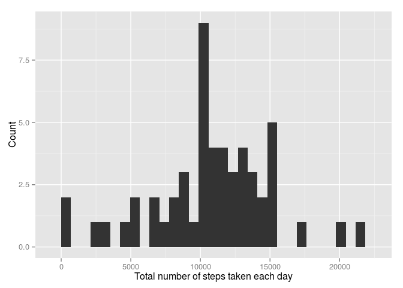
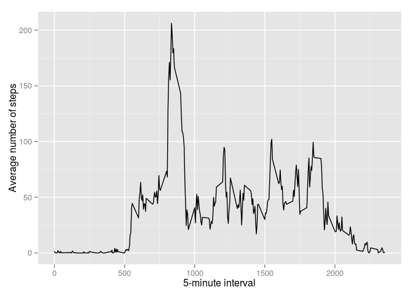
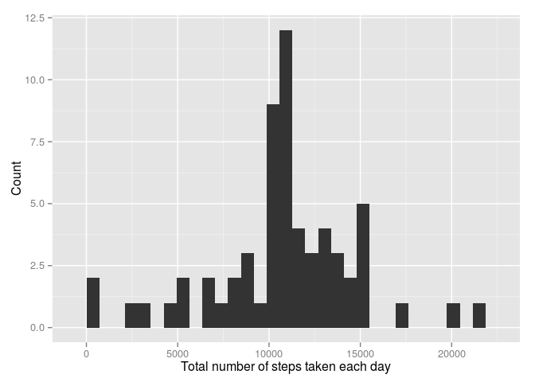
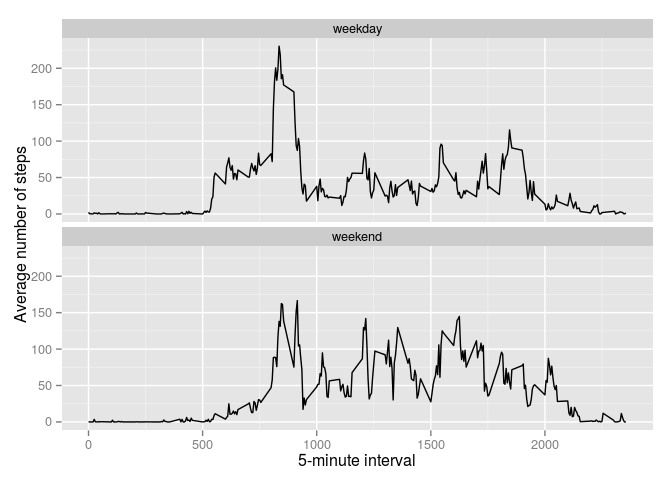

# Reproducible Research: Peer Assessment 1


## Loading and preprocessing the data
### Load the data
The raw file is in CSV format, so `read.csv` function will be used for loading the data.

```r
act <- read.csv("activity.csv")
```
### Preprocess the data
The data has been in long-format, so I think that it isn't needed to preprocess the data any more.


## What is mean total number of steps taken per day?
### Make the histogram
The histogram of the total number of steps taken each day is shown as:

```r
act.total <-
    act %>% filter(!is.na(steps)) %>% group_by(date) %>% summarise(total =
    sum(steps))
ph <- ggplot(act.total, aes(x = total)) + geom_histogram()
ph <- ph + labs(x = "Total number of steps taken each day", y = "Count")
ph
```

 

### Calculate the mean and median
The **mean** and **median** total number of steps taken per day is shown as:

```r
act.mm <-
    act %>% filter(!is.na(steps)) %>% group_by(date) %>% summarise(mean = mean(steps), median =
    median(steps))
xt <- xtable(act.mm)
print(xt, type = "html")
```

<!-- html table generated in R 3.2.3 by xtable 1.8-0 package -->
<!-- Sat Dec 12 12:01:12 2015 -->
<table border=1>
<tr> <th>  </th> <th> date </th> <th> mean </th> <th> median </th>  </tr>
  <tr> <td align="right"> 1 </td> <td> 2012-10-02 </td> <td align="right"> 0.44 </td> <td align="right"> 0.00 </td> </tr>
  <tr> <td align="right"> 2 </td> <td> 2012-10-03 </td> <td align="right"> 39.42 </td> <td align="right"> 0.00 </td> </tr>
  <tr> <td align="right"> 3 </td> <td> 2012-10-04 </td> <td align="right"> 42.07 </td> <td align="right"> 0.00 </td> </tr>
  <tr> <td align="right"> 4 </td> <td> 2012-10-05 </td> <td align="right"> 46.16 </td> <td align="right"> 0.00 </td> </tr>
  <tr> <td align="right"> 5 </td> <td> 2012-10-06 </td> <td align="right"> 53.54 </td> <td align="right"> 0.00 </td> </tr>
  <tr> <td align="right"> 6 </td> <td> 2012-10-07 </td> <td align="right"> 38.25 </td> <td align="right"> 0.00 </td> </tr>
  <tr> <td align="right"> 7 </td> <td> 2012-10-09 </td> <td align="right"> 44.48 </td> <td align="right"> 0.00 </td> </tr>
  <tr> <td align="right"> 8 </td> <td> 2012-10-10 </td> <td align="right"> 34.38 </td> <td align="right"> 0.00 </td> </tr>
  <tr> <td align="right"> 9 </td> <td> 2012-10-11 </td> <td align="right"> 35.78 </td> <td align="right"> 0.00 </td> </tr>
  <tr> <td align="right"> 10 </td> <td> 2012-10-12 </td> <td align="right"> 60.35 </td> <td align="right"> 0.00 </td> </tr>
  <tr> <td align="right"> 11 </td> <td> 2012-10-13 </td> <td align="right"> 43.15 </td> <td align="right"> 0.00 </td> </tr>
  <tr> <td align="right"> 12 </td> <td> 2012-10-14 </td> <td align="right"> 52.42 </td> <td align="right"> 0.00 </td> </tr>
  <tr> <td align="right"> 13 </td> <td> 2012-10-15 </td> <td align="right"> 35.20 </td> <td align="right"> 0.00 </td> </tr>
  <tr> <td align="right"> 14 </td> <td> 2012-10-16 </td> <td align="right"> 52.38 </td> <td align="right"> 0.00 </td> </tr>
  <tr> <td align="right"> 15 </td> <td> 2012-10-17 </td> <td align="right"> 46.71 </td> <td align="right"> 0.00 </td> </tr>
  <tr> <td align="right"> 16 </td> <td> 2012-10-18 </td> <td align="right"> 34.92 </td> <td align="right"> 0.00 </td> </tr>
  <tr> <td align="right"> 17 </td> <td> 2012-10-19 </td> <td align="right"> 41.07 </td> <td align="right"> 0.00 </td> </tr>
  <tr> <td align="right"> 18 </td> <td> 2012-10-20 </td> <td align="right"> 36.09 </td> <td align="right"> 0.00 </td> </tr>
  <tr> <td align="right"> 19 </td> <td> 2012-10-21 </td> <td align="right"> 30.63 </td> <td align="right"> 0.00 </td> </tr>
  <tr> <td align="right"> 20 </td> <td> 2012-10-22 </td> <td align="right"> 46.74 </td> <td align="right"> 0.00 </td> </tr>
  <tr> <td align="right"> 21 </td> <td> 2012-10-23 </td> <td align="right"> 30.97 </td> <td align="right"> 0.00 </td> </tr>
  <tr> <td align="right"> 22 </td> <td> 2012-10-24 </td> <td align="right"> 29.01 </td> <td align="right"> 0.00 </td> </tr>
  <tr> <td align="right"> 23 </td> <td> 2012-10-25 </td> <td align="right"> 8.65 </td> <td align="right"> 0.00 </td> </tr>
  <tr> <td align="right"> 24 </td> <td> 2012-10-26 </td> <td align="right"> 23.53 </td> <td align="right"> 0.00 </td> </tr>
  <tr> <td align="right"> 25 </td> <td> 2012-10-27 </td> <td align="right"> 35.14 </td> <td align="right"> 0.00 </td> </tr>
  <tr> <td align="right"> 26 </td> <td> 2012-10-28 </td> <td align="right"> 39.78 </td> <td align="right"> 0.00 </td> </tr>
  <tr> <td align="right"> 27 </td> <td> 2012-10-29 </td> <td align="right"> 17.42 </td> <td align="right"> 0.00 </td> </tr>
  <tr> <td align="right"> 28 </td> <td> 2012-10-30 </td> <td align="right"> 34.09 </td> <td align="right"> 0.00 </td> </tr>
  <tr> <td align="right"> 29 </td> <td> 2012-10-31 </td> <td align="right"> 53.52 </td> <td align="right"> 0.00 </td> </tr>
  <tr> <td align="right"> 30 </td> <td> 2012-11-02 </td> <td align="right"> 36.81 </td> <td align="right"> 0.00 </td> </tr>
  <tr> <td align="right"> 31 </td> <td> 2012-11-03 </td> <td align="right"> 36.70 </td> <td align="right"> 0.00 </td> </tr>
  <tr> <td align="right"> 32 </td> <td> 2012-11-05 </td> <td align="right"> 36.25 </td> <td align="right"> 0.00 </td> </tr>
  <tr> <td align="right"> 33 </td> <td> 2012-11-06 </td> <td align="right"> 28.94 </td> <td align="right"> 0.00 </td> </tr>
  <tr> <td align="right"> 34 </td> <td> 2012-11-07 </td> <td align="right"> 44.73 </td> <td align="right"> 0.00 </td> </tr>
  <tr> <td align="right"> 35 </td> <td> 2012-11-08 </td> <td align="right"> 11.18 </td> <td align="right"> 0.00 </td> </tr>
  <tr> <td align="right"> 36 </td> <td> 2012-11-11 </td> <td align="right"> 43.78 </td> <td align="right"> 0.00 </td> </tr>
  <tr> <td align="right"> 37 </td> <td> 2012-11-12 </td> <td align="right"> 37.38 </td> <td align="right"> 0.00 </td> </tr>
  <tr> <td align="right"> 38 </td> <td> 2012-11-13 </td> <td align="right"> 25.47 </td> <td align="right"> 0.00 </td> </tr>
  <tr> <td align="right"> 39 </td> <td> 2012-11-15 </td> <td align="right"> 0.14 </td> <td align="right"> 0.00 </td> </tr>
  <tr> <td align="right"> 40 </td> <td> 2012-11-16 </td> <td align="right"> 18.89 </td> <td align="right"> 0.00 </td> </tr>
  <tr> <td align="right"> 41 </td> <td> 2012-11-17 </td> <td align="right"> 49.79 </td> <td align="right"> 0.00 </td> </tr>
  <tr> <td align="right"> 42 </td> <td> 2012-11-18 </td> <td align="right"> 52.47 </td> <td align="right"> 0.00 </td> </tr>
  <tr> <td align="right"> 43 </td> <td> 2012-11-19 </td> <td align="right"> 30.70 </td> <td align="right"> 0.00 </td> </tr>
  <tr> <td align="right"> 44 </td> <td> 2012-11-20 </td> <td align="right"> 15.53 </td> <td align="right"> 0.00 </td> </tr>
  <tr> <td align="right"> 45 </td> <td> 2012-11-21 </td> <td align="right"> 44.40 </td> <td align="right"> 0.00 </td> </tr>
  <tr> <td align="right"> 46 </td> <td> 2012-11-22 </td> <td align="right"> 70.93 </td> <td align="right"> 0.00 </td> </tr>
  <tr> <td align="right"> 47 </td> <td> 2012-11-23 </td> <td align="right"> 73.59 </td> <td align="right"> 0.00 </td> </tr>
  <tr> <td align="right"> 48 </td> <td> 2012-11-24 </td> <td align="right"> 50.27 </td> <td align="right"> 0.00 </td> </tr>
  <tr> <td align="right"> 49 </td> <td> 2012-11-25 </td> <td align="right"> 41.09 </td> <td align="right"> 0.00 </td> </tr>
  <tr> <td align="right"> 50 </td> <td> 2012-11-26 </td> <td align="right"> 38.76 </td> <td align="right"> 0.00 </td> </tr>
  <tr> <td align="right"> 51 </td> <td> 2012-11-27 </td> <td align="right"> 47.38 </td> <td align="right"> 0.00 </td> </tr>
  <tr> <td align="right"> 52 </td> <td> 2012-11-28 </td> <td align="right"> 35.36 </td> <td align="right"> 0.00 </td> </tr>
  <tr> <td align="right"> 53 </td> <td> 2012-11-29 </td> <td align="right"> 24.47 </td> <td align="right"> 0.00 </td> </tr>
   </table>


## What is the average daily activity pattern?
### Make the time series plot
The time series plot ot the 5-minute interval (x-axis) and the average number of steps taken, averaged across all days (y-axis), is shown as:

```r
act.ave <-
    act %>% filter(!is.na(steps)) %>% group_by(interval) %>% summarise(ave =
    mean(steps))
pt <- ggplot(act.ave, aes(x = interval, y = ave)) + geom_line()
pt <- pt + labs(x = "5-minute interval", y = "Average number of steps")
pt
```

 

### Find the maximum
The 5-minute interval, on average across all the days in the dataset, contains the maximum number of steps, is:

```r
act.ave.max <- act.ave %>% arrange(desc(ave)) %>% top_n(1)
xt <- xtable(act.ave.max)
print(xt, type = "html")
```

<!-- html table generated in R 3.2.3 by xtable 1.8-0 package -->
<!-- Sat Dec 12 12:01:12 2015 -->
<table border=1>
<tr> <th>  </th> <th> interval </th> <th> ave </th>  </tr>
  <tr> <td align="right"> 1 </td> <td align="right"> 835 </td> <td align="right"> 206.17 </td> </tr>
   </table>


## Imputing missing values
### Calculate the total number of missing valuse

```r
act.na <- act %>% filter(is.na(steps)) %>% summarise(number = n())
```
The total number of missing values in the dataset (the total number of rows with NAs) is: 2304.

### Strategy for filling in missing values
Beacuse the missing values are always for a whole day, **the mean/median for that day** will not be suitable. Finally, the **mean for that 5-minute interval** (rounded to the integer) will be used to fill in all of the missing values in the dataset.

### Fill in the missing values
Create a new dataset that is equal to the original dataset but with the missing data filled in. The column named **step.new** is added.

```r
act.new <-
    act %>% group_by(interval) %>% mutate(steps.new = round(ifelse(
    is.na(steps), mean(steps, na.rm = TRUE), steps
    )))
```
### Make the histogram and calculate the mean and median
#### Make the histogram

```r
act.new.total <-
    act.new %>% group_by(date) %>% summarise(total = sum(steps.new))
ph2 <- ggplot(act.new.total, aes(x = total)) + geom_histogram()
ph2 <-
    ph2 + labs(x = "Total number of steps taken each day", y = "Count")
ph2
```

 

#### Calculate the mean and median

```r
act.new.mm <-
    act.new %>% group_by(date) %>% summarise(mean = mean(steps.new), median =
    median(steps.new))
xt <- xtable(act.new.mm)
print(xt, type = "html")
```

<!-- html table generated in R 3.2.3 by xtable 1.8-0 package -->
<!-- Sat Dec 12 12:01:12 2015 -->
<table border=1>
<tr> <th>  </th> <th> date </th> <th> mean </th> <th> median </th>  </tr>
  <tr> <td align="right"> 1 </td> <td> 2012-10-01 </td> <td align="right"> 37.37 </td> <td align="right"> 34.50 </td> </tr>
  <tr> <td align="right"> 2 </td> <td> 2012-10-02 </td> <td align="right"> 0.44 </td> <td align="right"> 0.00 </td> </tr>
  <tr> <td align="right"> 3 </td> <td> 2012-10-03 </td> <td align="right"> 39.42 </td> <td align="right"> 0.00 </td> </tr>
  <tr> <td align="right"> 4 </td> <td> 2012-10-04 </td> <td align="right"> 42.07 </td> <td align="right"> 0.00 </td> </tr>
  <tr> <td align="right"> 5 </td> <td> 2012-10-05 </td> <td align="right"> 46.16 </td> <td align="right"> 0.00 </td> </tr>
  <tr> <td align="right"> 6 </td> <td> 2012-10-06 </td> <td align="right"> 53.54 </td> <td align="right"> 0.00 </td> </tr>
  <tr> <td align="right"> 7 </td> <td> 2012-10-07 </td> <td align="right"> 38.25 </td> <td align="right"> 0.00 </td> </tr>
  <tr> <td align="right"> 8 </td> <td> 2012-10-08 </td> <td align="right"> 37.37 </td> <td align="right"> 34.50 </td> </tr>
  <tr> <td align="right"> 9 </td> <td> 2012-10-09 </td> <td align="right"> 44.48 </td> <td align="right"> 0.00 </td> </tr>
  <tr> <td align="right"> 10 </td> <td> 2012-10-10 </td> <td align="right"> 34.38 </td> <td align="right"> 0.00 </td> </tr>
  <tr> <td align="right"> 11 </td> <td> 2012-10-11 </td> <td align="right"> 35.78 </td> <td align="right"> 0.00 </td> </tr>
  <tr> <td align="right"> 12 </td> <td> 2012-10-12 </td> <td align="right"> 60.35 </td> <td align="right"> 0.00 </td> </tr>
  <tr> <td align="right"> 13 </td> <td> 2012-10-13 </td> <td align="right"> 43.15 </td> <td align="right"> 0.00 </td> </tr>
  <tr> <td align="right"> 14 </td> <td> 2012-10-14 </td> <td align="right"> 52.42 </td> <td align="right"> 0.00 </td> </tr>
  <tr> <td align="right"> 15 </td> <td> 2012-10-15 </td> <td align="right"> 35.20 </td> <td align="right"> 0.00 </td> </tr>
  <tr> <td align="right"> 16 </td> <td> 2012-10-16 </td> <td align="right"> 52.38 </td> <td align="right"> 0.00 </td> </tr>
  <tr> <td align="right"> 17 </td> <td> 2012-10-17 </td> <td align="right"> 46.71 </td> <td align="right"> 0.00 </td> </tr>
  <tr> <td align="right"> 18 </td> <td> 2012-10-18 </td> <td align="right"> 34.92 </td> <td align="right"> 0.00 </td> </tr>
  <tr> <td align="right"> 19 </td> <td> 2012-10-19 </td> <td align="right"> 41.07 </td> <td align="right"> 0.00 </td> </tr>
  <tr> <td align="right"> 20 </td> <td> 2012-10-20 </td> <td align="right"> 36.09 </td> <td align="right"> 0.00 </td> </tr>
  <tr> <td align="right"> 21 </td> <td> 2012-10-21 </td> <td align="right"> 30.63 </td> <td align="right"> 0.00 </td> </tr>
  <tr> <td align="right"> 22 </td> <td> 2012-10-22 </td> <td align="right"> 46.74 </td> <td align="right"> 0.00 </td> </tr>
  <tr> <td align="right"> 23 </td> <td> 2012-10-23 </td> <td align="right"> 30.97 </td> <td align="right"> 0.00 </td> </tr>
  <tr> <td align="right"> 24 </td> <td> 2012-10-24 </td> <td align="right"> 29.01 </td> <td align="right"> 0.00 </td> </tr>
  <tr> <td align="right"> 25 </td> <td> 2012-10-25 </td> <td align="right"> 8.65 </td> <td align="right"> 0.00 </td> </tr>
  <tr> <td align="right"> 26 </td> <td> 2012-10-26 </td> <td align="right"> 23.53 </td> <td align="right"> 0.00 </td> </tr>
  <tr> <td align="right"> 27 </td> <td> 2012-10-27 </td> <td align="right"> 35.14 </td> <td align="right"> 0.00 </td> </tr>
  <tr> <td align="right"> 28 </td> <td> 2012-10-28 </td> <td align="right"> 39.78 </td> <td align="right"> 0.00 </td> </tr>
  <tr> <td align="right"> 29 </td> <td> 2012-10-29 </td> <td align="right"> 17.42 </td> <td align="right"> 0.00 </td> </tr>
  <tr> <td align="right"> 30 </td> <td> 2012-10-30 </td> <td align="right"> 34.09 </td> <td align="right"> 0.00 </td> </tr>
  <tr> <td align="right"> 31 </td> <td> 2012-10-31 </td> <td align="right"> 53.52 </td> <td align="right"> 0.00 </td> </tr>
  <tr> <td align="right"> 32 </td> <td> 2012-11-01 </td> <td align="right"> 37.37 </td> <td align="right"> 34.50 </td> </tr>
  <tr> <td align="right"> 33 </td> <td> 2012-11-02 </td> <td align="right"> 36.81 </td> <td align="right"> 0.00 </td> </tr>
  <tr> <td align="right"> 34 </td> <td> 2012-11-03 </td> <td align="right"> 36.70 </td> <td align="right"> 0.00 </td> </tr>
  <tr> <td align="right"> 35 </td> <td> 2012-11-04 </td> <td align="right"> 37.37 </td> <td align="right"> 34.50 </td> </tr>
  <tr> <td align="right"> 36 </td> <td> 2012-11-05 </td> <td align="right"> 36.25 </td> <td align="right"> 0.00 </td> </tr>
  <tr> <td align="right"> 37 </td> <td> 2012-11-06 </td> <td align="right"> 28.94 </td> <td align="right"> 0.00 </td> </tr>
  <tr> <td align="right"> 38 </td> <td> 2012-11-07 </td> <td align="right"> 44.73 </td> <td align="right"> 0.00 </td> </tr>
  <tr> <td align="right"> 39 </td> <td> 2012-11-08 </td> <td align="right"> 11.18 </td> <td align="right"> 0.00 </td> </tr>
  <tr> <td align="right"> 40 </td> <td> 2012-11-09 </td> <td align="right"> 37.37 </td> <td align="right"> 34.50 </td> </tr>
  <tr> <td align="right"> 41 </td> <td> 2012-11-10 </td> <td align="right"> 37.37 </td> <td align="right"> 34.50 </td> </tr>
  <tr> <td align="right"> 42 </td> <td> 2012-11-11 </td> <td align="right"> 43.78 </td> <td align="right"> 0.00 </td> </tr>
  <tr> <td align="right"> 43 </td> <td> 2012-11-12 </td> <td align="right"> 37.38 </td> <td align="right"> 0.00 </td> </tr>
  <tr> <td align="right"> 44 </td> <td> 2012-11-13 </td> <td align="right"> 25.47 </td> <td align="right"> 0.00 </td> </tr>
  <tr> <td align="right"> 45 </td> <td> 2012-11-14 </td> <td align="right"> 37.37 </td> <td align="right"> 34.50 </td> </tr>
  <tr> <td align="right"> 46 </td> <td> 2012-11-15 </td> <td align="right"> 0.14 </td> <td align="right"> 0.00 </td> </tr>
  <tr> <td align="right"> 47 </td> <td> 2012-11-16 </td> <td align="right"> 18.89 </td> <td align="right"> 0.00 </td> </tr>
  <tr> <td align="right"> 48 </td> <td> 2012-11-17 </td> <td align="right"> 49.79 </td> <td align="right"> 0.00 </td> </tr>
  <tr> <td align="right"> 49 </td> <td> 2012-11-18 </td> <td align="right"> 52.47 </td> <td align="right"> 0.00 </td> </tr>
  <tr> <td align="right"> 50 </td> <td> 2012-11-19 </td> <td align="right"> 30.70 </td> <td align="right"> 0.00 </td> </tr>
  <tr> <td align="right"> 51 </td> <td> 2012-11-20 </td> <td align="right"> 15.53 </td> <td align="right"> 0.00 </td> </tr>
  <tr> <td align="right"> 52 </td> <td> 2012-11-21 </td> <td align="right"> 44.40 </td> <td align="right"> 0.00 </td> </tr>
  <tr> <td align="right"> 53 </td> <td> 2012-11-22 </td> <td align="right"> 70.93 </td> <td align="right"> 0.00 </td> </tr>
  <tr> <td align="right"> 54 </td> <td> 2012-11-23 </td> <td align="right"> 73.59 </td> <td align="right"> 0.00 </td> </tr>
  <tr> <td align="right"> 55 </td> <td> 2012-11-24 </td> <td align="right"> 50.27 </td> <td align="right"> 0.00 </td> </tr>
  <tr> <td align="right"> 56 </td> <td> 2012-11-25 </td> <td align="right"> 41.09 </td> <td align="right"> 0.00 </td> </tr>
  <tr> <td align="right"> 57 </td> <td> 2012-11-26 </td> <td align="right"> 38.76 </td> <td align="right"> 0.00 </td> </tr>
  <tr> <td align="right"> 58 </td> <td> 2012-11-27 </td> <td align="right"> 47.38 </td> <td align="right"> 0.00 </td> </tr>
  <tr> <td align="right"> 59 </td> <td> 2012-11-28 </td> <td align="right"> 35.36 </td> <td align="right"> 0.00 </td> </tr>
  <tr> <td align="right"> 60 </td> <td> 2012-11-29 </td> <td align="right"> 24.47 </td> <td align="right"> 0.00 </td> </tr>
  <tr> <td align="right"> 61 </td> <td> 2012-11-30 </td> <td align="right"> 37.37 </td> <td align="right"> 34.50 </td> </tr>
   </table>

#### The impact of imputing missing data
After imputting the missing data, the histogram has changed slightly, for example, the max count at the y-axis and the shape at the middle of the x-axis (around 11000). Besides, which can be seen in the **mean** and **median** table, the number of rows (days) has been changed from 53 to 61. The **mean** and **median** for days without missing data has not been changed, but those for days with missing data has been added.


## Are there differences in activity patterns between weekdays and weekends?
### Create a new factor variable
The week begins from Monday(1) to Sunday(7), which can be seen at column named **week.num**. And **weekday** equals 1-5, **weekend** equals 6-7, which can be seen at column named **week**.

```r
act.week <-
    act.new %>% mutate(week.num = ifelse(wday(as.Date(date)) == 1,7,wday(as.Date(date)) -
    1)) %>% mutate(week = as.factor(ifelse(week.num <= 5,"weekday", "weekend")))
```
### Make a panel plot
The panel plot containing a time series plot of the 5-minute interval (x-axis) and the average number of steps taken, averaged across all weekday days or weekend days (y-axis), is shown as:

```r
act.week.ave <-
    act.week %>% group_by(interval, week) %>% summarise(ave = mean(steps.new))
pt2 <- ggplot(act.week.ave, aes(x = interval, y = ave)) + geom_line()
pt2 <- pt2 + facet_wrap( ~ week, nrow = 2)
pt2 <-
    pt2 + labs(x = "5-minute interval", y = "Average number of steps")
pt2
```

 

